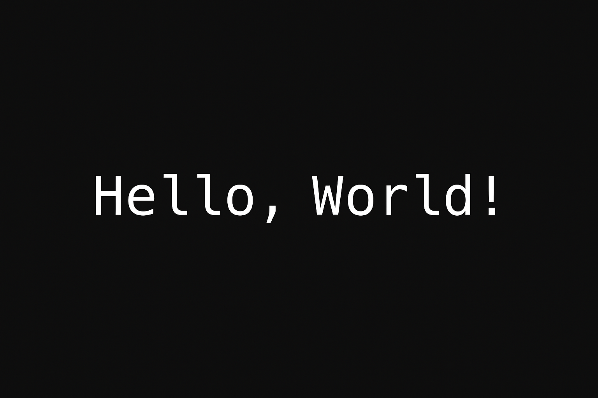

# 👋 Hello World in C  
*A Classic Beginner’s Program in the C Language*  



## ⚡ Summary
A simple and traditional **C program** that prints “Hello, World!” to the screen.

## 💻 Code Example
```c
#include <stdio.h>

int main() {
    printf("Hello, World!\n");
    return 0;
}
```

## 🖥️ Output
```
Hello, World!
```

## ⚙️ How to Run
```bash
gcc hello_world.c -o hello_world
./hello_world
```

## 👤 Author
BIHAR GOURAV  
(https://github.com/BGourav05/HELLO-WORLD)
